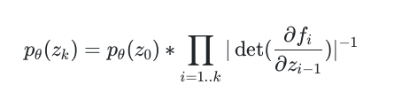
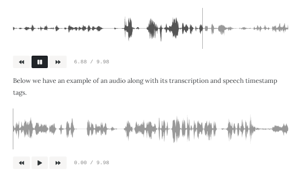

# tech @ vernacular.ai


This is source for the [tech team webpage][tech_blog] at Vernacular.ai. Template is [Mundana by WowThemes.net][mundana]

## Developing

- Install [rbenv](https://github.com/rbenv/rbenv) and
  [ruby-build](https://github.com/rbenv/ruby-build) for managing Ruby version.
- Install ruby version for this repo. `rbenv install 2.7.2`. A local
  `.ruby-version` file will make sure the repository uses consistent ruby
  version.
- Install [bundler](https://bundler.io/) using `gem install bundler`.
- Run `bundle` for installing dependencies.
- Run the blog locally: `bundle exec jekyll serve --host=0.0.0.0`

Deployment is handled via github actions using [this workflow](./.github/workflows/github-pages.yml) which gets triggered on every push.

### LaTeX

We use [MathJax v3](https://www.mathjax.org/) to render LaTeX equations. For
enabling in your post, add `latex: True` in your yaml frontmatter. After that,
equations under `$$` (note the double dollar sign) will be rendered like below:

```
$$p_\theta(z_k) = p_\theta(z_0)* \prod_{i=1..k}|\det(\frac{\partial f_i}{\partial z_{i-1}})|^{-1}$$
```



### Fancy audio player

Instead of the default HTML audio player, you can use a fancy audio player that
looks like the following:



For using this, add `fancy_audio_player: True` in your post's yaml frontmatter
and use `fancy_audio` tag like below:

```

```

[tech_blog]: https://tech.vernacular.ai/
[mundana]: https://github.com/wowthemesnet/mundana-theme-jekyll
