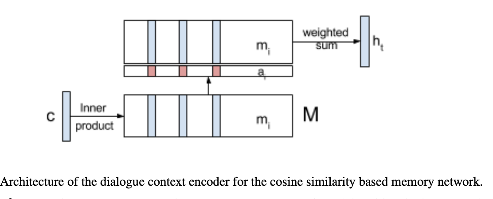
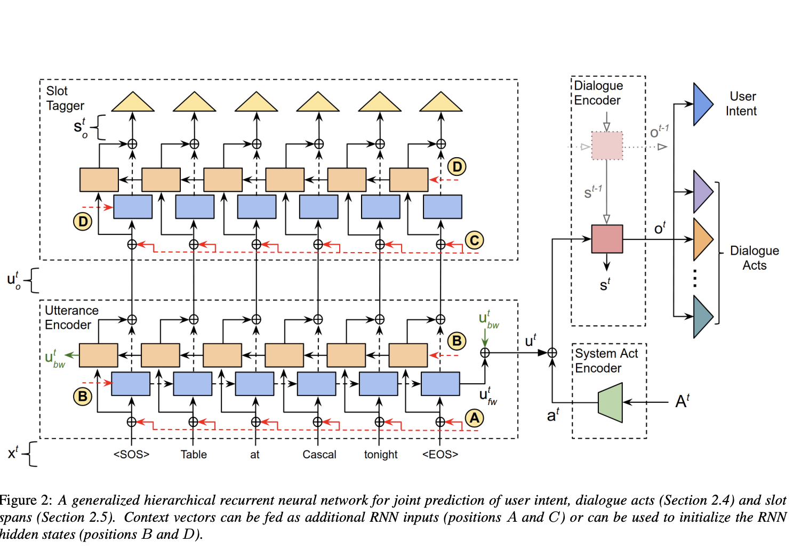

## Introduction
In task-oriented dialogue systems, the spoken language understanding, or SLU, refers to the task of parsing the natural language utterances into
semantic frames. The problem of contextual SLU majorly focuses on effectively incorporating dialogue information. Current SLU systems that work in tandem with
ASR (voice bots) only incorporate the asr transcription as an input for the SLU systems to predict intent. As such, the amount of information these transcripts have is quite less. 

## Why context?
The bot prompts are a treasure-trove of contextual information. This information can be used to build better intent classification model. Few examples with the bot prompts and their intents are shown below:

|                                                                                 **Bot Prompt**                                                                                | **User Response** |        **Intent**        |
|:-----------------------------------------------------------------------------------------------------------------------------------------------------------------------------:|:-----------------:|:------------------------:|
| Hi! I am Divya, your Hathway virtual assistant. Are you looking for a new Hathway Broadband connection?                                                                       | yes        | _confirm_new_connection_   |
| Okay!. To start with, please tell me if you are next to your Hathway device?                                                                                                  | I am              | _confirm_near_device_ |
| For how many people do you want to book the table for? | seven               | _number_guests_                  |

If we observe the first example here, the trancription just consists of _'yes'_, but if we include the bot prompt, we enrich the input to our SLU, thereby increasing the overall intent classification performance. The context of _hathway broadband connection_ helps in enriching the context of the utterance _yes_.

## Using Bot prompts as context
We curated a private dataset of clients wherein we collect user utterances along with all the bot prompts. 
We then concatenate the bot prompts with the user utterances. After retraining our intent classification model on some clients,
we observed a performance jump of **20-30%** in the intent-F1 scores.   
This probably happened because our user prompts are not rich with enough information and
closing that information deficit via the bot prompts helped us achieve better performance. Another probable reason for such a huge jump could be probably because the transcription generated while using voice bots are less accurate as compared to a chat bot's transcription wherein a user types their response. As a result, the gap increment when supplied with contextual information when working with voice bots is much larger than let's say a bot. However, this was not the case with all our datasets. We observed that
the datasets with large number of classes didn't perform well or at par with datasets with less number of classes. One probable reason for it could be the dataset having
a large amount of granularity with respect to intents and as such there wasn't any significant bump in the performance. We also observed that the performance with small-talk intents such as confirm, deny etc. had a massive jump in their performance as compared to other types of intents.

<!-- We curate a private data of our clients wherein we collect user utterances along with all the bot prompts. Earlier, our systems
were dependent on solely using user utterances to build our Intent classifier but after conctenating bot prompts to our utterances, we
observed around 30% jump in our intent-F1 scores for some of our clients. -->

## Some probable approaches from literature

After observing an improvement in our models by just using a single bot prompt, we decided to a delve a bit further and found out many 
approaches that can be utilized for our use-case. While doing literature review, I observed that encoding the contextual prompt along with the user prompt gives the best performance amongst all the methods. The current approach of concatenating bot prompts with the user prompt acts as a natural baseline for our subsequent experiments in this direction. We discuss the encoding based approaches from the literature below:

### Encoding dialogue History [1, 2]
1. We can encode [1] the complete dialogue history as shown below. Let us assume that the dialogue is
a sequence of $$D_{t} = {u_{1}, u_{2}.. u_{t}}$$ bot and user utterance and at every time 
step $$t$$ we are trying to output the classification for the user utterance $$u_{t}$$, given $$D_{t}$$.
We then divide the model into 2 components, the context encoder that acts on $$D_{t}$$ to produce
a vector representation of the dialogue context denoted by $$h_{t} = H(D_{t})$$ and the tagger, which takes
this context encoding $$h_{t}$$, and the current utterance $$u_{t}$$ as input and produces the intent output. 
 
    #### **Context Encoder Architecture**
    The **baseline context encoder** is just encoding the previous bot prompt $$u_{t-}$$ into a single bidirectional RNN (BiRNN) layer with Gated Recurrent Unit (GRU). The final state of the context encoder GRU is used the dialogue context, $$h_{t} = BiGRU(u_{t-1})$$.
    For **memory networks**, we encode all the dialogue context utterances, ${u_{1}, u_{2}.. u_{t}}$$ into memory networks denoted by $${m_{1}, m_{2}.. m_{t}}$$ using a BiGRU encoder. We add temporal context to the dialogue history utterances, we append special positional tokens to each utterance. $$m_{k} = BiGRU_{m}(u_{k}) \: \: 0 <= k <= t-1$$.
    The current utterance is also encoded using a BiGRU and denoted by $$c$$. Let $$M$$ be the matrix wherein the $$i$$th row given by $$m_{i}$$. A cosine similarity is obtained between each memory vector, $$m_{i}$$, and the context vector $c$. The softmax of this similarity is used as an attention distribution over the memory $M$, and an attention distribution over the moery $M$, and an attention weighted sum of $M$ is used to produce the dialogue context vector $h_{i}$.
      $$ a = softmax(M_{c}) $$
      $$ h_{t} = a^{T}M $$

#### **Tagger Architecture**
A stacked BiRNN tagger is used to model intent classification.

#### **Results**
This approach was benchmarked on a multi-turn dialogue sessions and for intent classification specifically the task of reserving tables at the 
restaurant. The intent F1 scores with memory network as the contextual encoder is **0.890** and just by encoding the last prompt is **0.865**.  

2. Another approach [2] is to have a different encoding mechanism for bot and user utterances [2]. This approach uses a system act encoder to obtain a vector representation $a^{t}$ of all system dialogue acts $A^{t}$. An utterance encoder is then used
to generate the user utterance encoding $$u^{t}$$ by processing the user utterance token embeddings $$x^{t}$$.
We then have a dialogue encoder that summarizes the content of the dialogue using $$a^{t}$$ and $$u^{t}$$, and its previous
hidden state $$s^{t-1}$$ to generate the dialogue context vector $$o^{t}$$, and also update the hidden state.
The dialogue context vector is then used for intent classification. Both the encoders use a hierarchical RNN that processes a single utterance at a time.

#### **System Act Encoder**
The system act encoder encodes the set of dialogue acts $$A^{t}$$ at turn $$t$$ into a vector $a^{t}$$ invariant to the order in which they appear.

#### **Utterance Encoder**
The utterance encoder takes in the list of user utterance tokens as input. Let $$x^{t}$$ denote the utterance token embeddings, which is encoded using a bi-directional GRU.
$$u^{t}, u^{t}_{o} = BRNN_{GRU}(x^{t})$$
We get the embedding representation $$u^{t}$$ of the user utterance and $$u^{t}_{o}$$ is the concatenation of the final states and the intermediate outputs of the forward and backward RNNs respectively.

#### **Dialogue Encoder**
The dialogue encoder incrementally generated the embedded representation of the dialogue context at every turn. As shown in the figure below, it takes in $$a^{t} \bigoplus u^{t}$$ and its previous state $$s^{t-1}$$ as inputs
and outputs the updated state $$s^{t}$$ and the encoded representation of the dialogue context $$o^{t}$$.

The above encoded feature is then flattened to the number of intent classes using a linear layer. 
    $$p_{i}^{t} = softmax(W_{i}.o^{t} + b_{i})$$

#### **Results**
The dialogues are obtained from simulated dialogues dataset.The dataset has dialogues from restaurant and movie domains with total of 3 intents. The baseline for this approach was getting results without any context and the overall intent accuracy was **84.76%** whereas using the previous dialog encoder ($$o^{t-1}$$) and the current system encoder  ($$a^{t}$$) was **99.54%**.

## Probable approaches
1. Another approach that has not been discussed in literature is using a time decay function to decay the effect of older bot prompts. This would help in focusing more
towards the recent prompts and reduce the effect of older prompts. 
2. We can also experiment by fusing different modalities (text and speech) with utterance and dialogue. The emotion from the speech modality could help in infusing much better context into the input for the intent classification.

## Conclusion
The above approaches and experiments show that context for SLU predictions can prove to be extremely useful for improving 
intent F1 scores. These above approaches are also not computationally expensive and can be easily deployed at scale for various use-cases.

## References
[1] Ankur Bapna, Gokhan Tür, Dilek Hakkani-Tür, and Larry Heck. 2017. Sequential Dialogue Context Modeling for Spoken Language Understanding. In Proceedings of the 18th Annual SIGdial Meeting on Discourse and Dialogue, pages 103–114, Saarbrücken, Germany. Association for Computational Linguistics. \
[2] Gupta, R., Rastogi, A., & Hakkani-Tür, D.Z. (2018). An Efficient Approach to Encoding Context for Spoken Language Understanding. ArXiv, abs/1807.00267.
