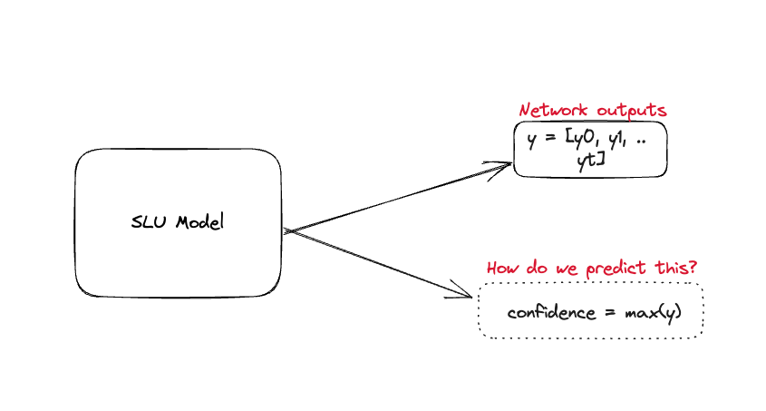
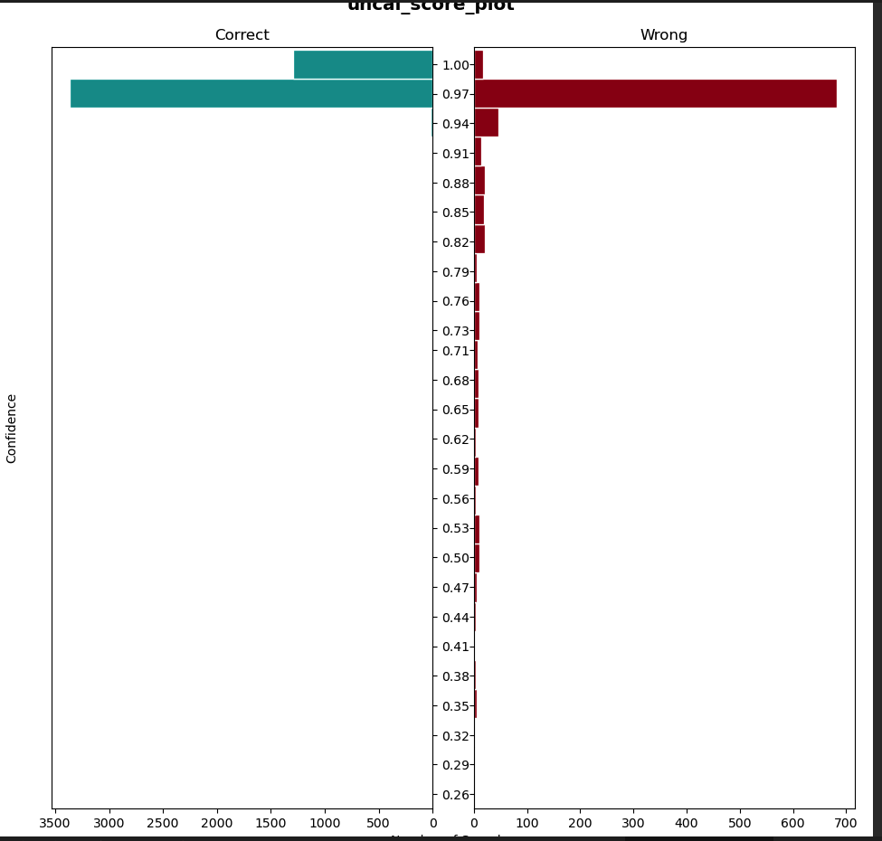
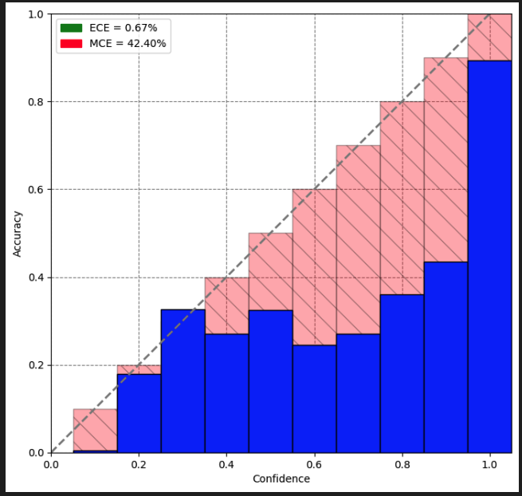
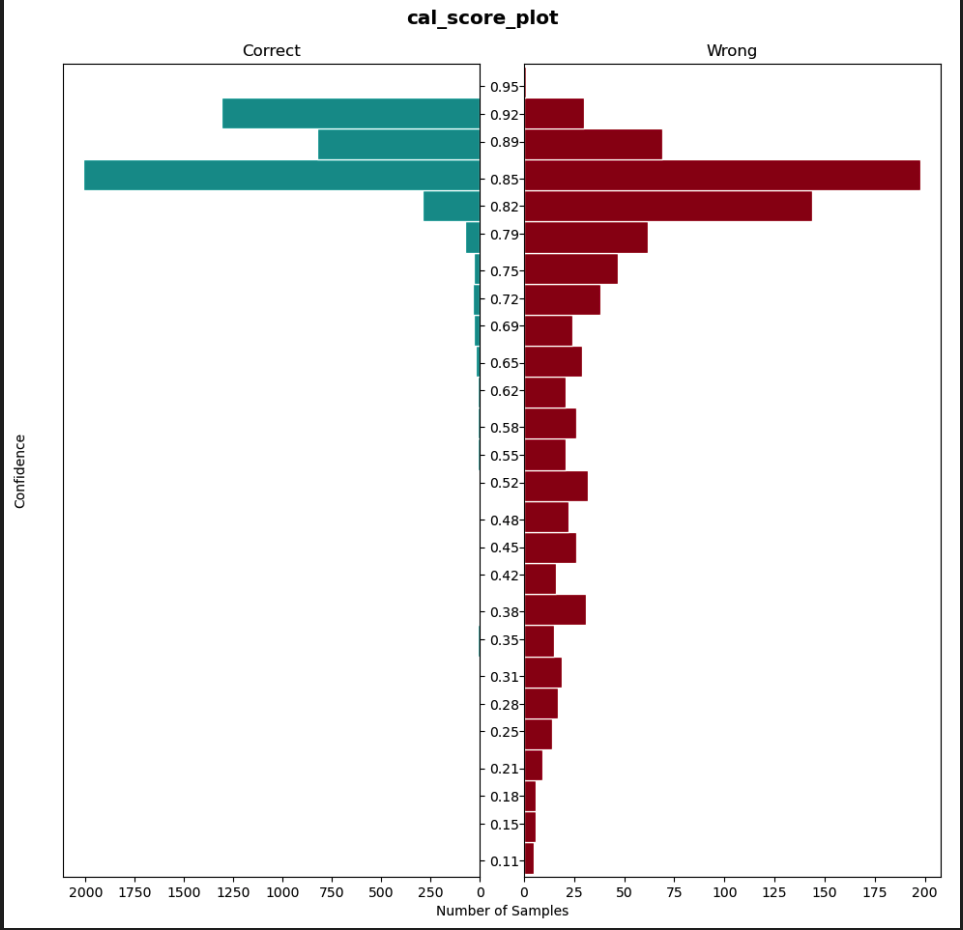
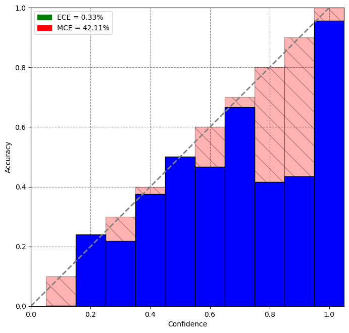
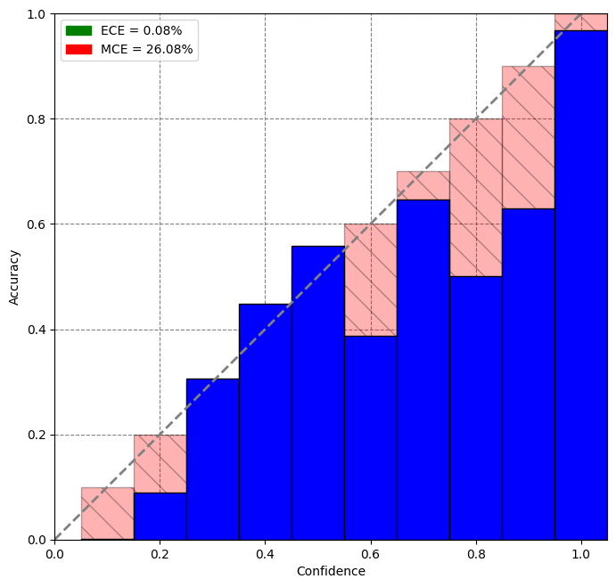
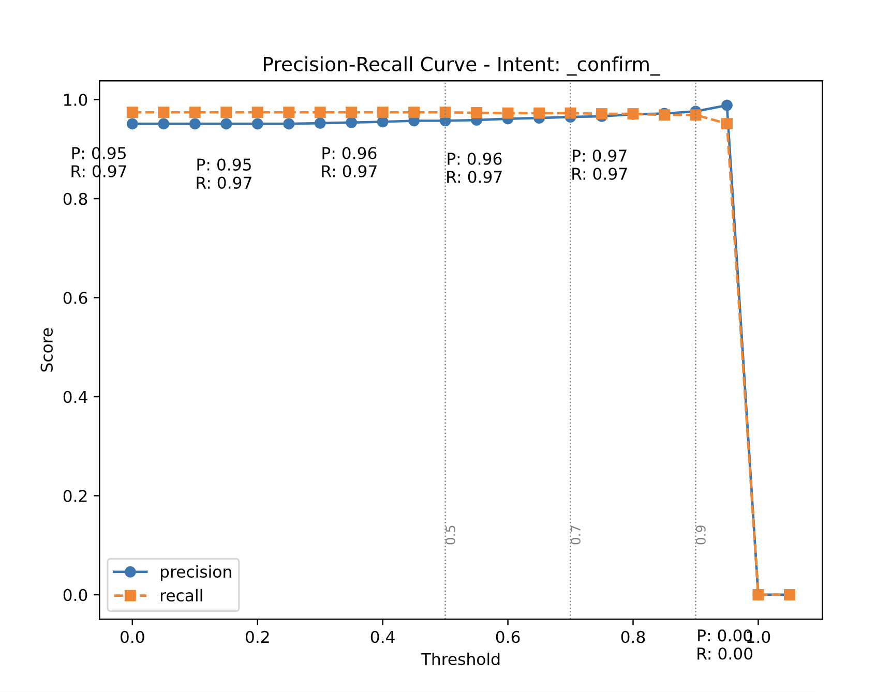

In the past 6 months, our team’s current focus has shifted to building robust and scalable voice-bots for the US companies. In particular, we are honing in on the use case of facilitating the collection of borrowed funds. Given the stringent compliance standards for user verification in the US, our voicebot must excel in this aspect, leaving no room for error. Our top priority is to avoid any inadvertent verification of false users, which could potentially lead to the exposure of sensitive debt-related information. As of now, **false** consumer **verifications are estimated to occur in ~0.67% of connected calls** on a custom dataset curated to tackle this problem. 

# Technical Analysis

We wanted to do a deep dive of the problem from an ML standpoint. We noticed that we needed to be more confident in our predictions. But what do we mean by confidence in our predictions? It is defined as the ability of the model to provide an accurate probability of correctness for any of its predictions. For example, if our SLU model predicts that the intent is `_confirm_` with a probability of 0.3 then the prediction has a 30% of being correct provided the model has been calibrated properly. 

|  | 
|:--:| 
| *This plot shows how under-confident we are on lower probabilities. Naturally, classes with low probabilities should be classified as wrong class predictions but our uncalibrated model is unable to do so.* |

We realized that **model miscalibration** and rejecting **low confidence prediction** is the major problem that we need to solve. But how do we quantify model calibration?

## Metrics and Diagrams

### Expected and Max Calibration Error

**Expected Calibration Error (ECE)** measures the disparity between a model's confidence and its accuracy. It can be computed directly using a closed-form formula or approximated by dividing predictions into bins based on their confidence scores. Within each bin, the average confidence and accuracy differences are calculated, and then ECE is obtained by taking a weighted average of these bin-wise differences proportional to the bin sizes.

**Maximum Calibration Error (MCE)** is similar to ECE but is equal to the maximum difference between average confidence and accuracy across bins.

$$
\begin{equation}
ECE = \sum_{i=1}^M \frac{|Bin_{i}|}{N}.|a_{i} - c_{i}|
\end{equation}

$$

$$
\begin{equation}
MCE = \max_{i \in \{1,\ldots,M\}} |a_{i} - c_{i}|
\end{equation}
$$

The lower the ECE and MCE values, the better calibrated the model is.

### Reliability Diagrams

Reliability diagrams depict accuracy on the y-axis and average confidence scores on the x-axis. A line plot is formed using the accuracy and the confidence points. A diagonal line through the origin indicates a perfectly calibrated model where confidence is equal to accuracy for each bin. 

|  | 
|:--:| 
| *Reliability diagram of our deployed model. The dashed line represents perfect calibration. The blue bins are the actual bins with these many predictions and their corresponding accuracy falling under one bin* |

# Adopted Solution

Upon careful analysis of our data and model, we have found evidence suggesting that calibrating our SLU (Spoken Language Understanding) models could effectively mitigate false positives and enhance the overall confidence of our model predictions. Subsequently, we delved into the existing literature to explore potential solutions to address this issue.

We came across multiple solutions that tackle model miscalibration such as Ensemble based Calibration [5], mixup [3], using Bayesian Neural Networks [4] etc. We narrowed it down to one solution that was easy to integrate and did not require us to re-train our models i.e. Temperature Scaling. 

## Temperature Scaling [1]

Temperature scaling involves tuning a softmax temperature value to minimize Negative Log-likelihood loss on a held-out validation set. This value is then used to *soften* the output of the softmax layer. 

$$
\begin{equation}
\text{Softmax}(y) = \frac{\exp(y_i)}{\sum_j \exp(y_j)}
\end{equation}
$$

$$
\begin{equation}
\text{Temp-Softmax}(y) = \frac{\exp(y_i/T)}{\sum_j \exp(y_j/T)}
\end{equation}
$$

The intuition behind temperature scaling is that the `T` value penalizes high probability scores thereby resulting in better confidence in these values.

After tuning a temperature scaling value on our validation dataset, we noticed that our model was better calibrated(Lower ECE and MCE values as well) and was able to better classify low-confidence score predictions.

|  | 
|:--:| 
| *Post calibration, we notice that we are able to better classify low-confidence scores under wrong prediction bins.* |

|  | 
|:--:| 
| *Old Reliability Graph on Validation Set* |

|  | 
|:--:| 
| *New Reliability Graph on Validation Set* |

## Thresholding

Keeping our current objective in mind where we reject low-confidence predictions, we realized that thresholding individual intents on a temperature-scaled model could work quite well for us. We wanted an increment in our precision numbers without hitting recall for our intents. This is because we want to maximize our confidence in the current prediction without inadvertently increasing our **False Negatives** i.e. we still want to be accurate while predicting our positive class (could be any intent here). We plotted precision-recall curves with thresholds on the x-axis and precision/recall on the y-axis. We have default recipes to generate these threshold values that ensure that we maximize precision without affecting the recall. The data scientist or an ML engineer then can have a look at these plots and accordingly decide which threshold values to go with if they feel that 

|  | 
|:--:| 
| *A precision-recall curve for the `_confirm_` intent.* |

# Results

After performing the above experiments on our datasets, we noticed a bump of ********************10 points******************** in macro-precision without affecting the macro-recall (+-loss of 1 point in recall). Our model became more robust to misclassifications and was able to reject low-confidence predictions thereby increasing the confidence in the model to handle sensitive compliance-related turns. Our product metrics also improved by a margin. After implementing the above solution we were able to bring down false consumer verification from **~0.67% to ~0.18%** of connected calls. 

# Caveats

Temperature Scaling does not work well when the dataset distributions differ i.e. whenever there’s data drift between the production data and the validation data, the calibration of the model is not accurate.  If there’s a data drift, the above methodology needs to be performed again to maintain data sanity. Thresholding affects recall (read reduce) when we go forward with maximizing precision gains.

# Citations

1. Guo, Chuan, et al. “On calibration of modern neural networks.” *International Conference on Machine Learning*. PMLR, 2017
2. [https://towardsdatascience.com/confidence-calibration-for-deep-networks-why-and-how-e2cd4fe4a086](https://towardsdatascience.com/confidence-calibration-for-deep-networks-why-and-how-e2cd4fe4a086)
3. Zhang, Hongyi, et al. “mixup: Beyond empirical risk minimization.” *arXiv preprint arXiv:1710.09412* (2017)
4. Neal, Radford M. *Bayesian learning for neural networks*. Vol. 118. Springer Science & Business Media, 2012.
5. Lakshminarayanan, Balaji, Alexander Pritzel, and Charles Blundell. “Simple and scalable predictive uncertainty estimation using deep ensembles.” *Advances in neural information processing systems* 30 (2017).